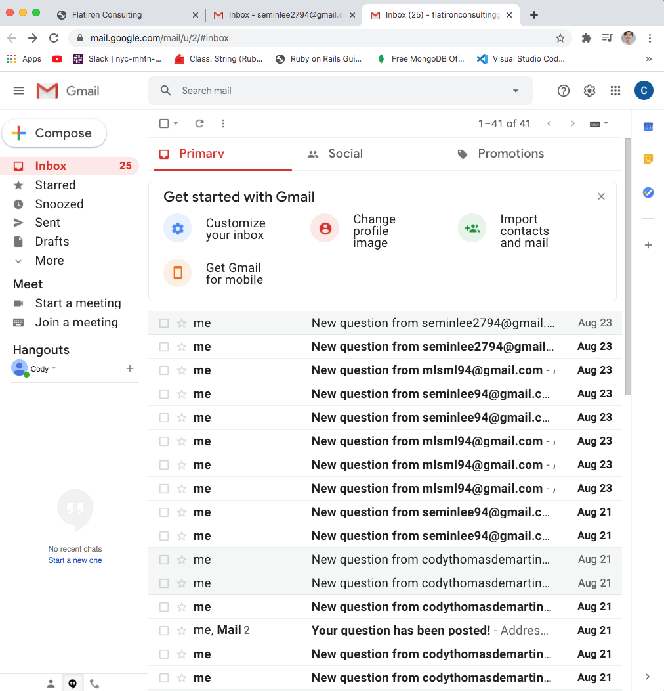
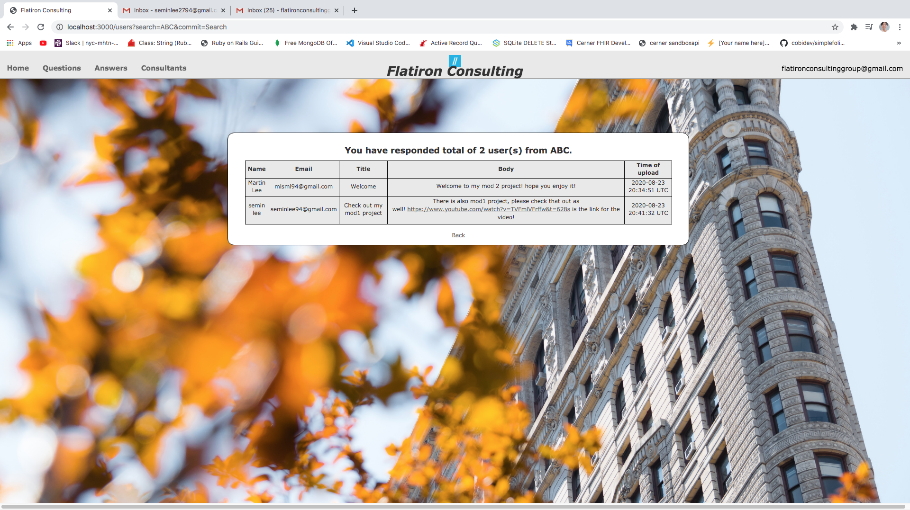

# Q&A for businesses

## About✅
This project was intended to make a Q&A page for a consulting company. We wanted the client to ask a question privately, without being able to see other client's questions. 

## Included Features✅
- Client can ask a private question.
- Once the question is submitted, e-mail is sent out to the client and consultant in charge.
- Client will receive email when the consultant answers the question.
- The consultant should be able to sort out his/her responses by client's company.

## Versions...✅
- Ruby 2.6.1p33
- Rails 6.0.3.2
- Yarn 1.22.4
- sqlite3 1.4.2

## Used...✅
- Omniauth + Devise for user authentication.
- ActionMailer for email system.
- ActionText for text boxes.
- Active Storage for image uploads.
  
## Stretch goals✅
- Add chatting feature using Action Cable.
- Search user by using @ mentions.
- Brush up on the styling.

## Getting started✅
- Clone the repository
- Bundle install
- ``` brew install yarn ``` to install yarn.
- ``` rails db:migrate ``` to migrate the schema. 

## Into the app 🚀
Let's start by signing up. You can sign up manually, or use GoogleOauth2 and use existing email. Once you are signed up, go to profile by hovering over the email address on the top right corner. You can upload profile picture from your computer. Fill in the rest of the information, because it helps our consultants to find their clients by company. 
Let's go over to the question section to ask a new question. Ding-- you should've received an email from flatironconsultinggroup@gmail.com saying that consultants have received your question, and will be back with your response. Consultants also receive reminder emails to answer the question, so don't worry about not getting your question answered. 



What? You want to know what your company has asked about a particular category of a question? No worries! Our consultants can sort through by company's name to fetch their response to the company's questions. 



app/controllers/user_controller user#index looks like this:
```   
  def index
    @users = User.search(params[:search])
    @common_emails = current_user.both_arrays(current_user.response_user_i, @users)
  end
```
@common_emails takes in the method defined in user's model with arguments of 2 arrays (consultant's response to a specific category of question, and user's specific company). We have iterated through the consultant's particular expertise, which is linked to question's category, and iterated through that iteration through company to get the results.


Hope you enjoyed our project! 

## Developers✅
### Se Min Lee
- email: seminlee2794@gmail.com
- github: https://github.com/Seminlee94
- linkedIn: https://www.linkedin.com/in/se-min-lee-149188105/
- Medium: https://medium.com/@mlsml94
- portfolio: https://seminlee94.github.io/semin/

### Cody DeMartin

# Demo✅
- https://www.youtube.com/watch?v=sn4SqkDkPZQ&t=62s

## Please check out Se Min Lee's other demos and projects.
#### Demo
- https://www.youtube.com/watch?v=TVFmlVFrffw&t=5s << Shop N Cook
- https://www.youtube.com/watch?v=58Dlbg41p70 << WALL-E

#### Github Codes
- https://github.com/jakelozano94/ruby-project-guidelines-nyc01-seng-ft-071320 << Shop N Cook
- https://github.com/abeciana1/wal-e-frontend << WALL-E(Front end)
- https://github.com/abeciana1/wal-e-backend << WALL-E(Back end)
- https://github.com/Seminlee94/mod4project-react << Cart-In(Front end)
- https://github.com/Seminlee94/mod4project-backend << Cart-In(Back end)

